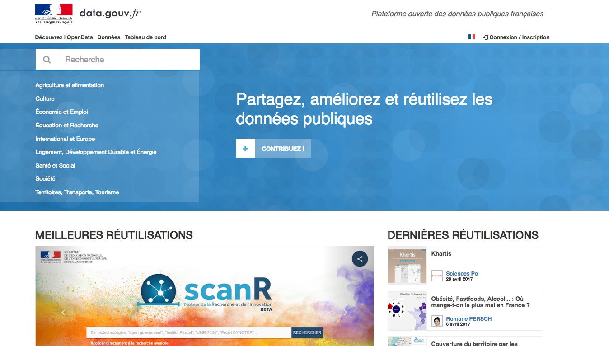
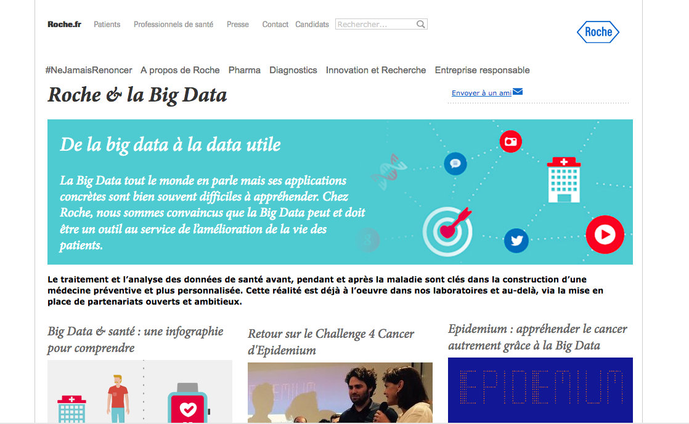
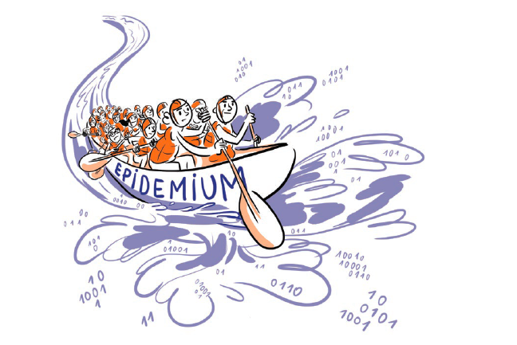

### L’ouverture des données de santé : une entrée par les acteurs

**[Chiffres privés, chiffres publics](https://chiffres.hypotheses.org) : Calculs, comptabilités et statistiques XVIIe-XXIe siècle**

Co-production de chiffres publics

*Journée d’études 31 mai 2017*

+++

- François Briatte :  European School of political and social sciences, Université Catholique de Lille [francois.briatte@univ-catholille.fr](francois.briatte@univ-catholille.fr )

- Célya Gruson-Daniel : Centre Virchow-Villermé de santé publique Paris-Berlin, Université de Technologie de Compiègne (Costech), Université de Laval-Québec (LabCMO) [celya.gruson-daniel@parisdescartes.fr](celya.gruson-daniel@parisdescartes.fr)

### Des chiffres à la *data*

Passage des notions de :
- chiffres ->  *data*
- calcul -> méthodes algorithmiques
- statistique complétée par fouille de données (*Data mining*), classification (*clustering*), apprentissage supervisé (*machine learning*), etc.

+++

*[site de la Société Française de Statistique-17-05-29](https://www.sfds.asso.fr/)*

### Des chiffres à la *data*

Passage des qualificatifs de :  

- publics/ privés  : open, intérêt général, sensibles, personnelles
- mais aussi big, smart, utile...

+++

*[site data.gouv.fr-17-05-29](http://www.data.gouv.fr/fr/)*

+++

*[site Roche-17-05-29](http://www.roche.fr/innovation-recherche-medicale/big-data-sante.html)*

### Imaginaire numérique et *data*

