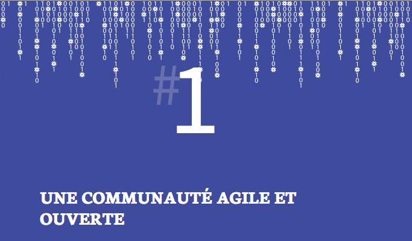
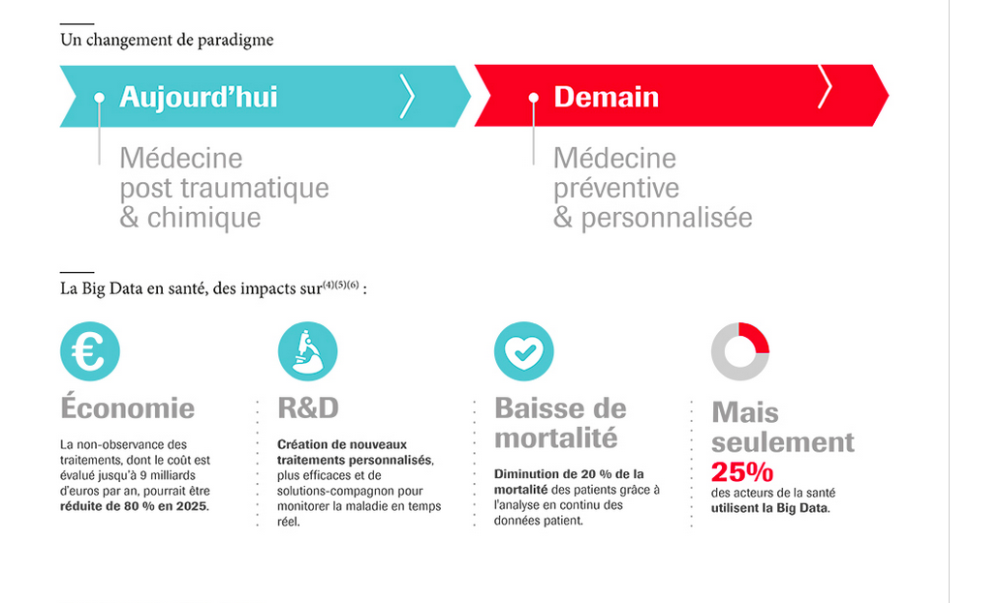

### L’ouverture des données de santé : une entrée par les acteurs

**[Chiffres privés, chiffres publics](https://chiffres.hypotheses.org) : Calculs, comptabilités et statistiques XVIIe-XXIe siècle**

Co-production de chiffres publics

*Journée d’études 31 mai 2017*

+++

- François Briatte :  European School of political and social sciences, Université Catholique de Lille [francois.briatte@univ-catholille.fr](francois.briatte@univ-catholille.fr )

- Célya Gruson-Daniel : Centre Virchow-Villermé de santé publique Paris-Berlin, Université de Technologie de Compiègne (Costech), Université de Laval-Québec (LabCMO) [celya.gruson-daniel@parisdescartes.fr](celya.gruson-daniel@parisdescartes.fr)

---

### Des chiffres à la *data*

Passage des notions de :
- Chiffres ->  *data* ;
- calcul -> méthodes algorithmiques ;
- statistique complétée par fouille de données (*Data mining*), classification (*clustering*), apprentissage supervisé (*machine learning*), etc.

+++

*[site de la Société Française de Statistique-17-05-29](https://www.sfds.asso.fr/)*

---

### Des chiffres à la *data*

Passage des qualificatifs de :  

- Publics/ privés  ->  *open*, données ouvertes, d'intérêt général, sensibles, personnelles ;
- mais aussi *big*, *smart*, utile...

+++

*[site data.gouv.fr-17-05-29](http://www.data.gouv.fr/fr/)*

+++

*[site Roche-17-05-29](http://www.roche.fr/innovation-recherche-medicale/big-data-sante.html)*

---

### Imaginaire numérique et *data*

Horizons d’attentes fortes autour de ce « monde des données » d’un point de vue :

- Économique, social, scientifique, politique dans de nombreux domaines (effet « pervasif » du numérique) ; *(Boullier, 2016) *
- associés à un imaginaire numérique : idéal du partage, de la transparence, de la collaboration. *(Gruson-Daniel et al., 2016;  Ibekwe-Sanjuan et al., 2015; Turner, 2012)*

+++

*[CC-BY-ND-Epidemium](http://www.epidemium.cc/white-paper-fr/index.html)*

+++

 *[CC-BY-ND-Epidemium](http://www.epidemium.cc/white-paper-fr/index.html)*

---
### Imaginaire numérique et *data*

*Open Big Data* : une formule (Krieg-Planque, 2009) employée par tous mais des **significations multiples** qui révèlent différents **enjeux et intérêts** :

  - *big data* : maitrise technique, enjeux économiques, avantages compétitifs ;
  - *open data* : enjeu gestionnaire, économique, démocratique.

+++

*[Infographie Roche : La Big Data au coeur de la santé](http://www.roche.fr/innovation-recherche-medicale/big-data-sante/infographie.html)*

---
### Imaginaire numérique et *data*

Mais en continuité des différents concepts associés à la quantification : construction, usages des chiffres  (mesurer vs classer, décrire vs décider et gouverner)

---

### Open Data & Santé : une entrée par les acteurs

La Santé : domaine d'étude pour cette présentation

 > Quelles recompositions l'« open big data » provoque dans le domaine de la santé et de sa quantification ?

+++

### Open Data & Santé : une entrée par les acteurs

Une entrée par les acteurs pour :

- Comprendre les processus en jeu dans l'ouverture des données de santé
- observer les dynamiques en cours entre les différentes parties prenantes provenant à la fois de la sphère publique et privée ;

---

### Open Data & Santé : deux cas d'étude

- 1/ **Ouverture de données publiques de santé** (SNIIRAM-DAMIR) ==> place des acteurs privés et redéfinition de leur rôle dans un espace préexistant ;
- 2/ **Épidemium :Open Data challenge autour des données du cancer** entre un laboratoire pharmaceutique Roche et un laboratoire collaboratif ouvert La Paillasse ==> création d’un dispositif interstitiel.

Approche exploratoire et embarquée : participation à des réunions, lecture de rapport livre blanc, suivi de listes de discussions, échanges avec les acteurs concernés…

---

### Open Data & Santé : Cadre théorique (1)

Étude de la construction sociale des chiffres/données et de leurs usages dans les sphères :

- De l’action publique : politiques de la quantification (Bardet et Jany-Catrice, 2010), usages de la statistique publique (Desrosières, 2005), valeur sociale du chiffre (Ogien, 2010) ;

- de l’activité scientifique : construction des bases de donnée (Bowker et Star, 2000), travail invisible (Mauz et Granjou, 2011), enjeux des inter-médiations  (Schlierf et Meyer, 2013)

- et plus spécifiquement de la santé : rationalisation gestionnaire (Bertillot, 2016), nouveau management public (Belorgey, 2010) ; réformes des systèmes sanitaires (Briatte, 2011, 2013; Hunsmann, 2016)

+++

### Open Data & Santé : Cadre théorique (2)

Appui sur les travaux récents : ce que les *data* et l’*open* provoquent :

- *Datafication* et reconfiguration de collectifs en science (Bastin et Francony, 2016; Gruson-Daniel Célya et De Quatrebarbes Constance, 2016),
- institutionnalisation de pratiques numériques (Lhoste et Barbier, 2016) ,
- administration publique et brutification des données (Denis et Goeta, 2013)
- politiques de l'ouverture en santé (Briatte et Goëta, 2014).
